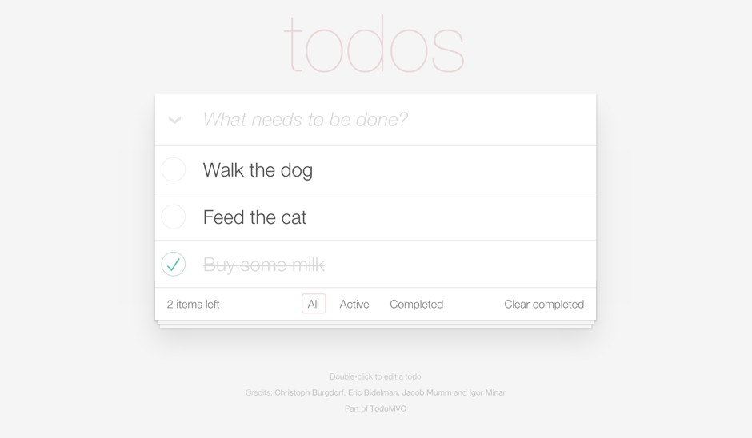
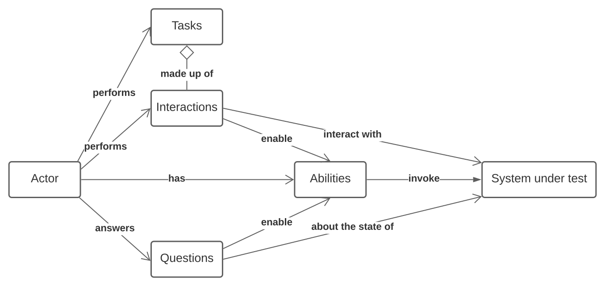

# Your First Screenplay Scenario

The Screenplay Pattern is a way to write clean, readable, scalable test automation modelled around the user. 

Screenplay builds on good software engineering principles such as the Single Responsibility Principle, the Open-Closed Principle, and effective use of Layers of Abstraction. It encourages good testing habits and well-designed test suites that are easy to read, easy to maintain and easy to extend, enabling teams to write more robust and more reliable automated tests more effectively.

In this section, we will show you how to write your first Screenplay scenario using Serenity BDD. You will learn how to write a simple scenario for the well-known [TodoMVC](http://todomvc.com) project.



## Prerequesites
To run this tutorial, you will need a few things installed on your machine:
* **Java**: Serenity BDD is a Java library, so you'll need a recent JDK installed. JDK 1.8 or higher should be fine.
* **A Java IDE**: You'll also need a Java Development Environment such as IntelliJ or Eclipse (and a working knowledge of Java).
* **Git**: We'll be using a starter project on Github, and the sample code for this project lives on Github too, so I'll be assuming you have a basic understanding of Git.

## Introducing the Screenplay Pattern

The goal of the Screenplay pattern is to help you write cleaner, more readable, more maintainable test automation code for any domain. With Screenplay, your tests use an intuative, readable style like the following:
```java
        wendy.attemptsTo(
                Navigate.toTheHomePage(),
                Search.byKeyword("Everest"),
                Ensure.that(DisplayedArticle.firstHeading()).isEqualTo("Mount Everest")
        );
```

As you can see here, Screenplay uses a user-centric model, where we describe _actors_ who interact with an application in various ways to perform _tasks_ that help them acheive their goals. Actors have _abilities_, such as the ability to interact with a web browser or query a database, that help them perform these tasks. Actors can also answer _questions_ about the state of the system, so that we can check whether a feature is behaving the way we would expect it to.




## Creating a Screenplay project

The quickest way to start a new Screenplay project is to clone one of the starter projects. For this tutorial, we will start with the [Serenity JUnit Screenplay Starter project](https://github.com/serenity-bdd/serenity-junit-screenplay-starter), which uses Serenity Screenplay and JUnit 5.


:::tip
This starter project has a sample Screenplay test in the `src/test/java/starter/wikipedia` folder. You won't need this code for this tutorial so you can safely delete it.
:::

## Writing your first scenario

For our 

